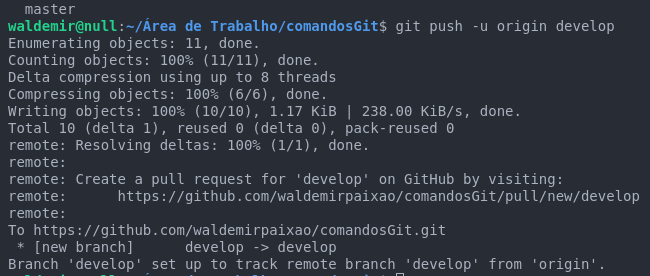

# Git push

## O que é git push?

**Git push** serve para atualizar a branch remota no repositório git hub, neste caso,  a partir da branch local. Geralmente colocamos na branch local o mesmo nome da branch remota.

Caso exista a branch remota digite o comando abaixo para que os seus dados sejam enviados para a sua branch remota.

* **git push**

Caso não exista a branch remota: será criada uma branch remotra traqueada (rastreada) com a branch remota.

* **git push -u origin develop**

Veja o resulta abaixo após digitar o comando

